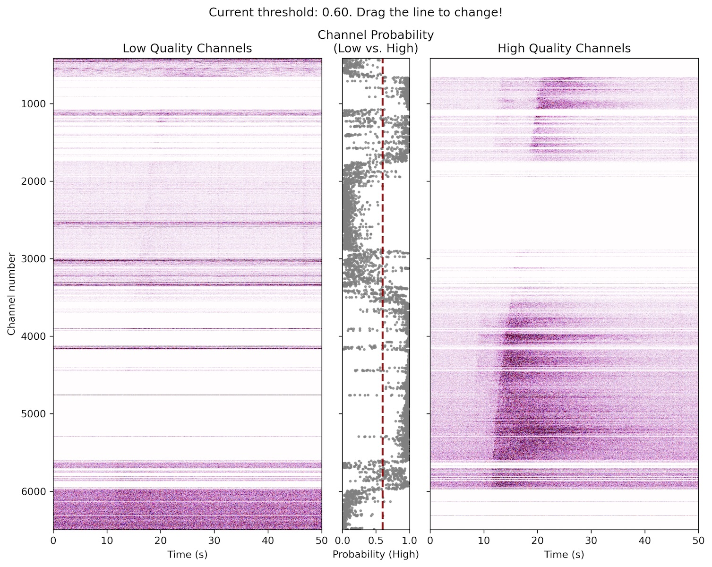
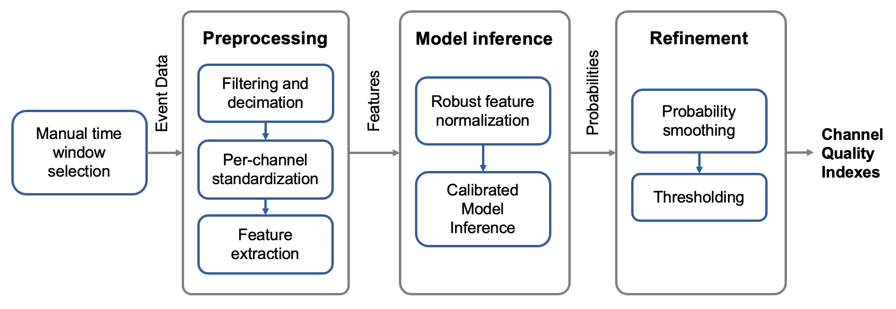
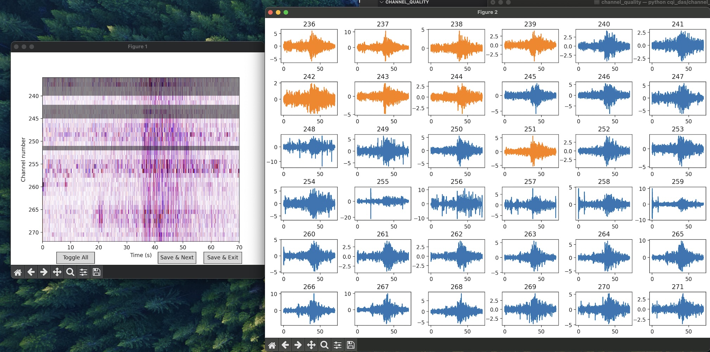
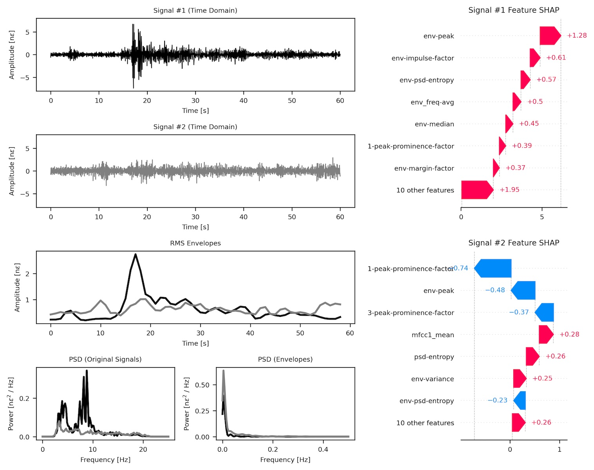

# Channel Quality Index - Automatic Identification of High-quality Channels in Distributed Acoustic Sensing

The **cqi_das** Python module provides tools to **detect and label high and low quality channels** in Distributed Acoustic Sensing (DAS) data for **submarine cables**. It includes two different functionalities, for both **automatic** channel-quality prediction (via `calculate_cqi`) and **manual** channel labeling (via `ChannelSelector`).



## What `cqi_das` Is

Distributed Acoustic Sensing (DAS) data can contain many channels over long distances. Not all channels are equal in terms of signal quality, and **cqi_das** helps:
1. **Predict** channel quality (i.e., the refined probability of a channel being high-quality).
2. **Manually label** channels for cases custom classification is needed. Useful for training data generation.

`cqi_das` was developed for **submarine cables** data. The performance drops when applied to land segments of cable.

## Installation

Download or clone the repository. From the root of the project, run:

```bash
pip install .
```
> Tip: It’s often easier to work in an isolated environment such as conda or virtualenv.


### Usage example

To calculate the CQI on a dataset, the function `calculate_cqi` is used. First, the user should select a 
30-60 seconds window around the event. Any land channels should also be excluded.

```python
import cqi_das
import pandas as pd
import h5py

def import_h5(filename: str):
    """
    Example function to load .h5 data into a DataFrame.
    """
    with h5py.File(filename, "r") as fp:
        data_array = fp["data"][...]
        df = pd.DataFrame(data_array).T
    return df

data = import_h5("example.h5")

# Predict probabilities for each channel
cqis = cqi_das.calculate_cqi(data, sampling_rate=50)
print(cqis)
```

Below is an explanation of the main parameters of `calculate_cqi`:

- **data** : `pd.DataFrame`  
  Each column is one DAS channel; rows represent time samples.

- **sampling_rate** : `float`, default=50  
  Sampling rate of the DAS signals in Hz.

- **channel_smoothing** : `float`, default=0.5  
  Alpha parameter for exponential smoothing of the predicted probabilities.

- **decision_threshold** : `float`, optional  
  If provided, transform probabilities into 0/1 classification. If not given, return probabilities.

- **interactive** : `bool`, default=False  
  If `True`, opens an interactive matplotlib plot for threshold adjustment. The selected threshold is saved and used for setting the 0/1 selection.

- **num_jobs** : `int`, default=1   
  Number of jobs to run the feature extraction. Can help speed-up.

`calculate_cqi` returns a `pd.Series` with the quality indexes for every channel in `data`. 

### Interactive mode

Setting the parameter `calculate_cqi(..., interactive=True)` enables the interactive selection of the decision threshold. A plot such as the one at the beginning of the page is generated, and the decision threshold line can be clicked and
dragged to change the threshold. When the figure is closed, the threshold that is currently set is used as the decision threshold. When this is used, the output is a prediction 0 or 1, instead of a probability.

### CQI processing steps

The CQI for a given channel is the result of several processing steps. Internally, CQI follows the following processing flow.



The `notebooks/` folder contains various Jupyter notebooks that illustrate how the channel-quality index (CQI) model was developed and trained. You can open these notebooks to understand:
- How features were extracted from DAS data.
- How the model was optimized and validated.


## Manual Data Labeling Through `ChannelSelector`
Besides automatic classification, `cqi_das` provides `ChannelSelector` for a manual channel labeling workflow. This is was useful for the creation of the training and validation sets during the design of CQI.

```python
selector = cqi_das.ChannelSelector(data, dt=0.02, start_channel=0, output_fname="mylabels.csv")
selector.auto_select_using_snr(threshold=3)  # Optional auto-labelling step
selector.select(slice_size=50)
print(selector.get_selections())
selector.save_selections()

```

`ChannelSelector` uses an interactive GUI to mark channels as “good” or “bad” quality. 
- Right click a signal to mark it as bad quality.
- Left click a signal to mark it good quality.
- Double click a signal to open a zoomed view.

Two plots are connected and interactively updated to ease the manual labelling process.


## How does CQI work?

CQI combines interpretable signal features into a machine learning model to predict the probability that a model has high quality. Below is an example of two different signals, high and low quality, with the respective impact of different
features on the model based on SHAP values.


